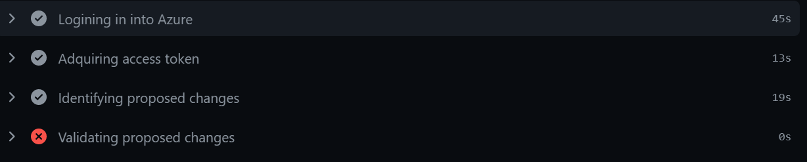
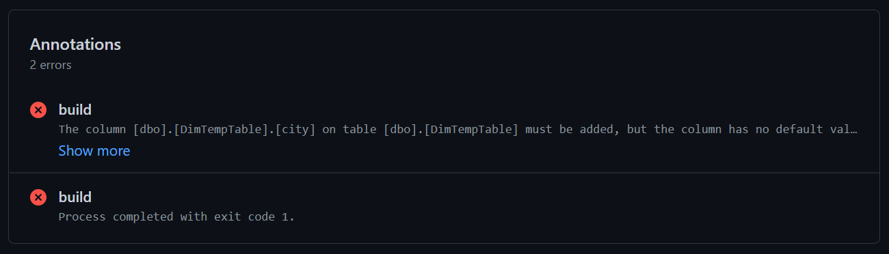

# Azure Synapse CI/CD pipeline with GitHub Workflows

This repository contains an implementation of a CI/CD pipeline using GitHub Workflows to package, validate and integrate changes into an Azure Synapse Database. This implementatio[n can also be used with Azure SQL Databases, Azure SQL Managed Instances and Microsoft SQL Server running on a VM. Check the quickstart section](#Quickstart) to get yourself started with this template.

## Implementation

This CI/CD implementation relies on the use of [SqlPackage](https://docs.microsoft.com/en-us/sql/tools/sqlpackage/) and [Visual Studio Database Projects](https://docs.microsoft.com/en-us/visualstudio/data-tools/creating-and-managing-databases-and-data-tier-applications-in-visual-studio), which provides a convenient way to define the desired state of a database and apply/evolve the schema to different databases on different environments.

### About database projects

You can use database projects to create new databases and to update existing databases enabling you to apply version control and project management techniques to your database development efforts in much the same way that you apply those techniques to managed or native code. You can help your development team manage changes to databases and database servers by creating a database project, or a server project and putting it under version control. Members of your team can then check out files to make, build, and test changes in an isolated development environment, or sandbox, before sharing them with the team. To help ensure code quality, your team can finish and test all changes for a particular release of the database in a staging environment before you deploy the changes into production.

### About SqlPackage

[SqlPackage.exe](https://docs.microsoft.com/en-us/sql/tools/sqlpackage/) is a command-line utility that automates validation and deployment of database projects for SQL Server, Azure SQL Database and Azure Synapse. It provides a convenient way to administer the evolution of the schema of a database. `SqlPackage` is available for both Windows and Linux systems. 

## CI/CD workflows

This repository contains 2 workflows:
 - **Synapse-CI:** A workflow for building a database project and validate the database schema against an integration database server. (usually a DEV environment). 3 outputs are generated: a DACPAC containing the desired database schema, a SQL file containing the SQL instructions to create the database and a MD file which all the data issues, warnings and changes that will be applied into the target database.
 - **Synapse-CD:** A workflow for publishing a database project packaged as a DACPAC into a target environment. This process allows to deploy the same DACPAC generated by the CI job to multiple target databases in different environments.

### Validations performed by the jobs

The CI/CD jobs will perform 2 steps to validate the changes in the schema that are being introduced:

 1) **Identifying proposed changes:** The database schema specified in the DACPAC file is compared with the current state of the database and a delta is computed. This delta will contain all the changes that had to be done on `target` to match the DACPAC specification.
 2) **Validating proposed changes:** The computed changes are now parsed to identify how they may affect the deployment in some way. Changes are categorized in 3 categories:
    * **Data issues:** These are changes introduced by the package that will centainly make the deployment to fail and hence need to be resolved before going on. These changes will make the job to fail.
    * **Warnings:** These are changes introduced by the package that may represent a concern in terms of the integrity of the data or a potential data loss. These changes are notified but they will not make the job to fail.
    * **Changes:** there are all the operations that will be performed in the target database in order to move it from it's current version to the version proposed in the DACPAC. 

### How issues or warnings are notified?

Both issues and warnings are logged into the annotation board in GitHub where a detail about the issue is presented for reviewing:

## CI/CD custom actions

This repository contains custom GitHub Actions to facilitate the work done by the jobs. Check the [Custom Actions documentation for more information](docs/actions.md)

## Quickstart

If you are planing to use this CI/CD implementation in your deployment, follow the [Quickstart guide](docs/quickstart.md) to configure all the elements that you need in your repository.
