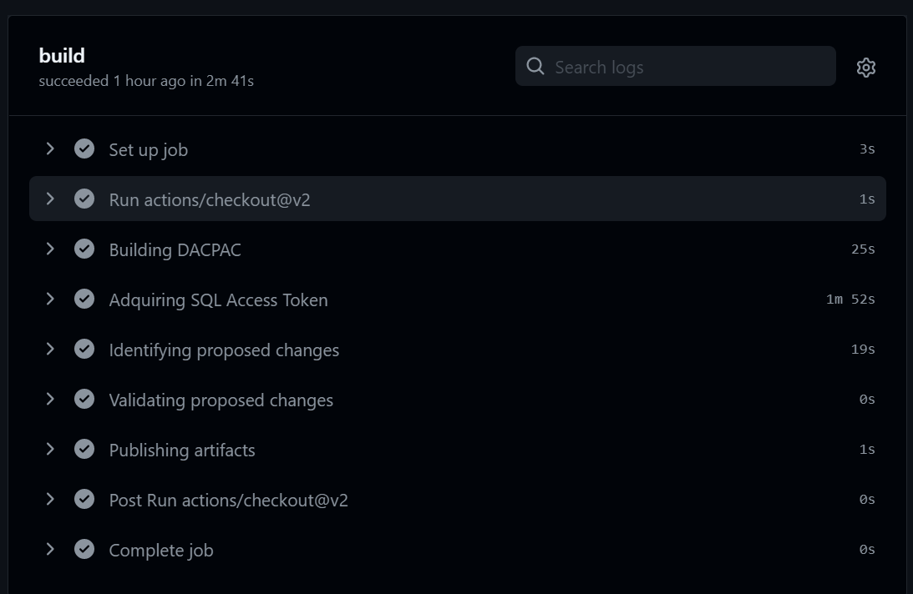
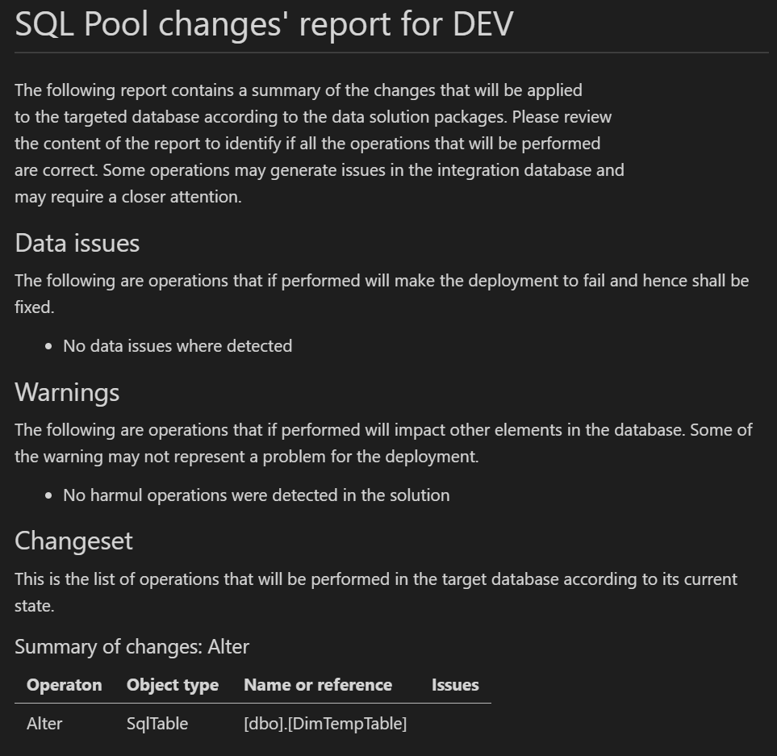
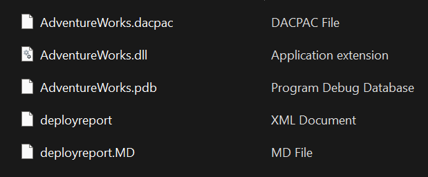
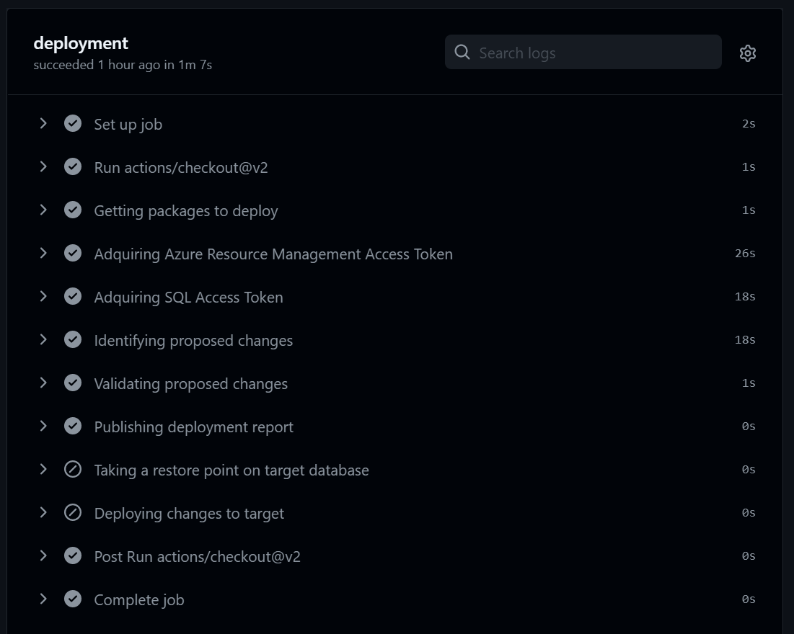
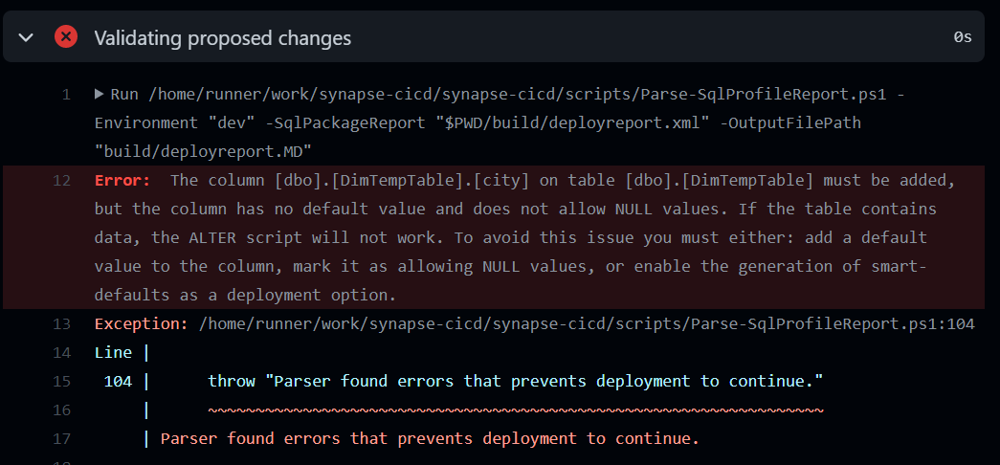
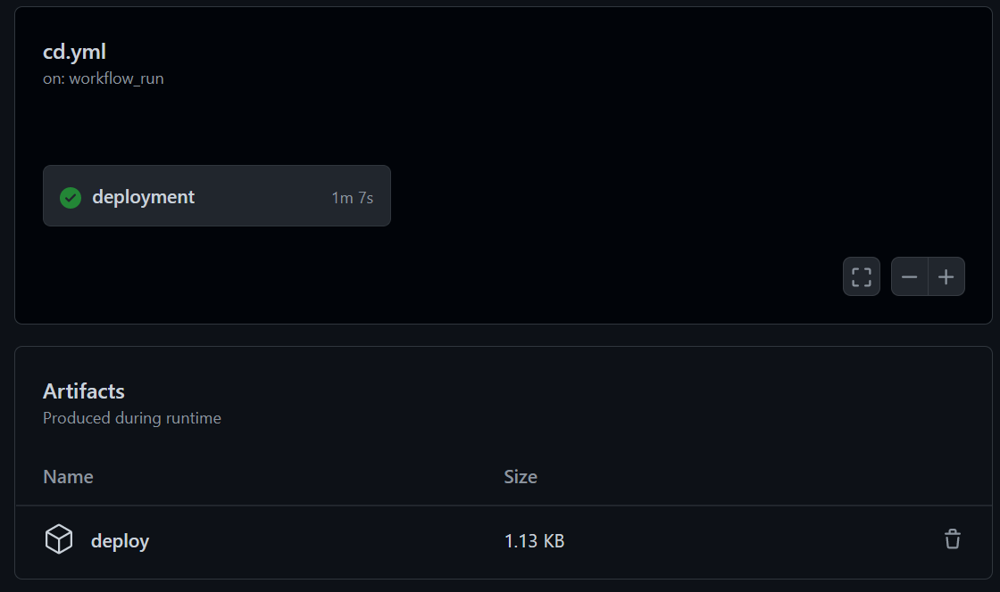

Azure Synapse CI/CD reference
=============================
The repostiroy contains 2 jobs implemented, one for continuous integration and one for continous deployment.

CI job
------
Will run each time a pull request to main is done or changes are commited directly to main. This jobs will build the data solutions included in the respository and validate that the changes introduced in the schemas/databases can be integrated into an integration `Azure Synapse Database` or `Azure SQL Database`. If the changes can be integrated, then the job will complete correctly. Otherwise, it will fail. The integration database server can be either dedicated for the team owning the repository or it can be shared across different teams. Changes are validated but not deployed in this job.

The following steps are executed:
 - **Building DACPAC:** This step builds all the [Visual Studio Database Projects](https://docs.microsoft.com/en-us/visualstudio/data-tools/creating-and-managing-databases-and-data-tier-applications-in-visual-studio) that are contained in the folder `src`. The result of this step is one or multiple `dacpac` files created in the `outputpath` folder. In this implementation, the such folder is `build`.
 - **Adquiring SQL Access Token:** This steps adquired an Authentication Token on behalf of the Service Principal configured. This token is requested to access the target database in the next step. The credentials used are indicated in the GitHub secret `AZURE_CREDENTIALS` which needs to be created in order to run this CI/CD jobs.
 - **Identifying proposed changes:** Runs `SqlPackage` tool utility to detect which are the changes introduced by the database solution according to the current state of the target database. The target database can be indicated either in the step or it can be readed from the publishing profile used for deployment. In this implementation, we are getting the name of the server and the name of the database from the publishing profile directly. 
 - **Validating proposed changes:** This steps validates the detected changes. If any data error is found, then the job will fail. Warnings are reported to the job. A `md` file is generated with a summary of all the changes of all the `dacpac` built.  The following is an example of this file:

 - **Publishing artifacts:** All the assets that were build, included reports and `dacpac`s are packaged and published as artifacts that can be downloaded later.

CD job
------
Will run each time the CI job completes correctly. This job will pull the artifacts that were built and will validate them against the corresponding environment. In this case, this CD is targeting a `development` environment, but it can be generalized to any. If the validation is completes successfuly, then a `restore point` is generated in the target deployment and finally the deployment is performed.

The following steps are executed:
 - **Getting packages to deploy:** This step download all the assets that were built by the CI job.
 - **Adquiring Azure Resource Management Access Token:** This steps adquired an Authentication Token on behalf of the Service Principal configured. This token is requested to perform a `restore point` in the target database. The credentials used are indicated in the GitHub secret `AZURE_CREDENTIALS` which needs to be created in order to run this CI/CD jobs.
 - **Adquiring SQL Access Token:** This steps adquired an Authentication Token on behalf of the Service Principal configured. This token is requested to access the target database in the next step. The credentials used are indicated in the GitHub secret `AZURE_CREDENTIALS` which needs to be created in order to run this CI/CD jobs. Pay attention that this is different to the token indicated above as this token is issued for accessing the database, while the otherone is issued for performing backup operations (ARM).
 - **Identifying proposed changes:** Runs `SqlPackage` tool utility to detect which are the changes introduced by the database solution according to the current state of the target database. The target database can be indicated either in the step or it can be readed from the publishing profile used for deployment. In this implementation, we are getting the name of the server and the name of the database from the publishing profile directly.
 - **Validating proposed changes:** This steps validates the detected changes. If any data error is found, then the job will fail. Warnings are reported to the job. A `md` file is generated with a summary of all the changes of all the `dacpac` built.

if the validation fails, the job will be aborted.

 - **Publishing deployment report:** The deployment report generated above is uploaded as an artifact.
 - **Taking a restore point on target database:** This steps takes a `restore point` in the target database. In this implementation, the parameter `synapse-workspace` is set to `true` meaning that the `restore point` is for a Azure Synapse Workspace. For `Azure SQL Database` set that parameter to `false`. This steps is skipped if no changes were detected during the validation phase.
 - **Deploying changes to target:** Runs `SqlPackage` utility to perform the changes in the target database according as it was reported in the `deployment report`. This steps is skipped if no changes were detected during the validation phase.

