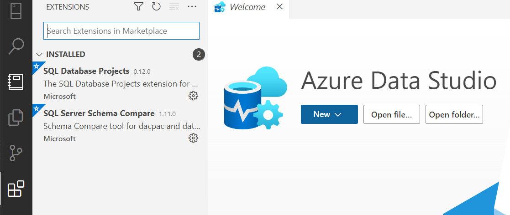
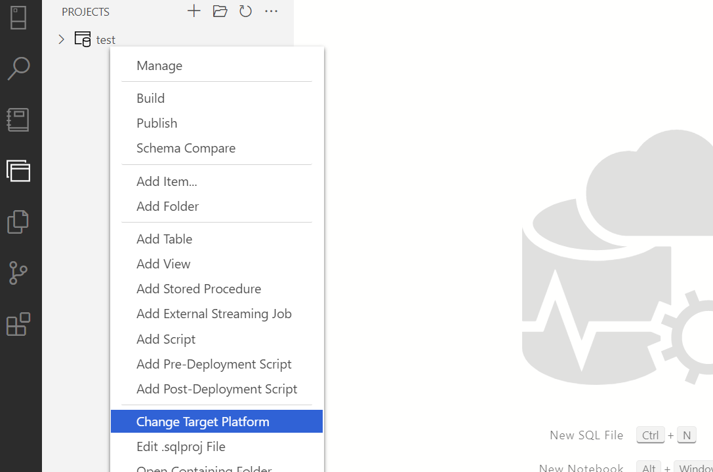

# Quickstart

This guide is intended to get you up and running in using this repository for your CI/CD pipelines in your own environment.

## Tools you will need

 - You will need [Azure Data Studio](https://docs.microsoft.com/en-us/sql/azure-data-studio/download-azure-data-studio) installed in your computer. Alternatively you can use VSCode with the Data Project extension installed, Visual Studio, or SQL Server Data Tools, but we recommend Azure Data Studio because it is lightweight and specific for this scenario. You can see [installation instruction here](https://docs.microsoft.com/en-us/sql/azure-data-studio/download-azure-data-studio). 
 - If you are using Azure Data Studio or VSCode, make sure you have the `SQL Data Project extension` installed. Just open the extensions tab and look for it:

 

## Follow this steps to create you first solution:

 1. Clone this repository.
 2. Open the `src` folder with `Azure Data Studio` and make any change you want into the schema. This repo contains a demo schema for the `AdventureWorks` data warehouse. Feel free to delete the solution and create you own solution if you want. Just make sure that the solution is:
    - Placed in the `src` folder
    - It is a `SQL Data Project`
    - The target of the project matchs the target database server you will be using (`Azure Synapse` vs `Azure SQL Database`). See the [notes at the bottom for more details about how to do this](#changing-the-target-database-type-in-azure-data-studio).
 3. Review the `SQL Publishing Profile` file located in `profiles` folder. This file contains the instructions about how deployment should follow. In particular, you will have to change:
    - **TargetDatabaseName:** This is the name of the database targeted in the CI/CD. If you want to specify the database inside of your pipelines instead of in this file, the GitHub Actions support doing so. Check the [Custom Actions documentation](actions.md) to know how to make the changes.
    - **TargetConnectionString:** This is the target database server used in the CI/CD. If you want to specify the database server inside of your pipelines instead of in this file, the GitHub Actions support doing so. Check the [Custom Actions documentation](actions.md) to know how to make the changes.
    - Pay attention that the publishing profile name follows the convention `[ENVIRONMENT_PREIX].publish.xml`. In this repository we are only providing the corresponding to `DEV` but you might want to have one per each environment. Since the publishing profile defines what **can and cannot be done** when deploying changes to the database, it is nice to have such restrictions inplace depending on the environment. However, you might find yourself having the exactly same file for all the environments.
 4. Open [.github/workflows/cd.yml (for GitHub Actions)](../.github/workflows/cd.yml) or [.azure-pipelines/synapse-cd.yml (for Azure Devops Pipelines)](../.azure-pipelines/synapse-cd.yml) and edit the environment variables as needed. Probably the one you have to change is `RESOURCE_GROUP` which should be the name of the resource group where the database is located. This parameter is needed since `CD` implements backup strategy before deployment actually happens. Backups require to know the name of the resource group where the database is located.
    - **Hint:** If you have a IaC process inplace, it is a good option to collect that information from the previous step.
 5. Configure your environment to connect to Azure:
    - **If you are using GitHub Actions:**
      - Create the GitHub secrets to access your Azure environment. All the jobs in this repository will try to pull the credentials to access Azure using a secret called `AZURE_CREDENTIALS`. You should create this secret and populate it with the information of the Service Principal that you want to use for deployment. If you don't have Service Principal created, [you can create one following this steps](https://docs.microsoft.com/en-us/azure/active-directory/develop/howto-create-service-principal-portal). The secrets have to be stored JSON format. [Check this guide to know how](https://github.com/marketplace/actions/azure-login#configure-deployment-credentials).
    - **If you are using Azure DevOps:**
      - Create a service connection in your project to reach your Azure Environment. [You can follow this steps if you don't know how to do it](https://docs.microsoft.com/en-us/azure/devops/pipelines/library/service-endpoints?view=azure-devops&tabs=yaml). Both CD and CI pipelines reference this service connection in an environment variable. By default, the name is `rg-dataplatform-dev`, but you can change it to the name of the Service Connection you configured.
 6. Ensure the service principal has the right permissions.
    - Ensure the service principal has access to the target database resource. You can assign `contributor` access from the IAM section in the portal, which should be enough.
    - Ensure the service principal can login into the database. The following SQL script can be used to gran a Service Principal access to the database for the purpoise of this CI/CD. Replace `<IDENTITY>` with the name of your Service Principal and `<ROLE>` with the desired role to grant (for instance, `db_owner`)

    ```sql
    IF NOT EXISTS (SELECT [name]
                FROM [sys].[database_principals]
                WHERE [type] = N'E' AND [name] = N'<IDENTITY>')
    BEGIN
        CREATE USER [<IDENTITY>] FROM EXTERNAL PROVIDER
    END
    EXEC sp_addrolemember '<ROLE>', [<IDENTITY>];
    ```

You should be all set to use this CI/CD implementation.

## Notes

### Changing the target database type in Azure Data Studio

In order for this CI/CD to correctly interpreat the proposed schemas for the database, you will need to set the target database type. In `Azure Data Studio` you can achieve that by:

 - If you are creating a new project, make sure to select the right platform target. For Azure Synapse pick `Microsoft Azure SQL Data Warehouse`


 - If you already have an existing project, you can change the target anytime by:


